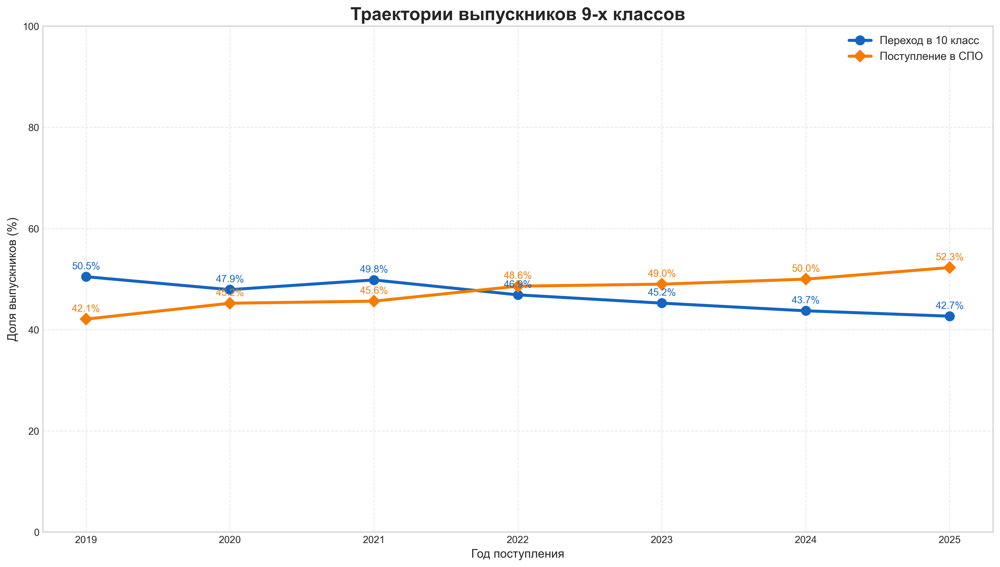

# Образовательные траектории

> Анализ образовательной статистики России: переход в 10 класс и поступление в СПО, обработка Excel, CSV и графики.

**Стек:** Python · Pandas · NumPy · Matplotlib · Excel

## Задача

Скрипт извлекает показатели из статистических форм по общему и среднему профессиональному образованию и сравнивает число учащихся 10 класса и поступивших в СПО с числом девятиклассников предыдущего доступного года.

## Что находится в репозитории

- `analyze_data.py` — поиск Excel-файлов, извлечение показателей, расчёты и график.
- Файлы статистических форм `.xls` и `.xlsx` за разные годы.
- `education_statistics.csv` — сохранённая итоговая таблица.
- `education_trajectories.png` — сохранённая визуализация.



## Запуск

```bash
git clone https://github.com/shvlade/Big_data.git
cd Big_data
python -m venv .venv
```

Активируйте `.venv` (`.venv\Scripts\Activate.ps1` в PowerShell или `source .venv/bin/activate` в bash), затем:

```bash
python -m pip install pandas numpy matplotlib openpyxl xlrd
python analyze_data.py
```

Запускайте из корня репозитория: скрипт ищет Excel в текущей папке и перезаписывает CSV и PNG результата.

## Как устроен расчёт

1. Отбираются файлы, в названии которых есть год.
2. Находятся листы и строки статистических форм.
3. Числовые значения очищаются от пробелов и приводятся к целым числам.
4. Формируется таблица с долями перехода в 10 класс и СПО.
5. Сохраняются CSV и график.

Это оценка по агрегированным формам. Скрипт сопоставляет соседние доступные годы, а не отслеживает индивидуальные траектории учеников; пропуски и изменения структуры Excel требуют проверки.

---

[← Профиль и другие проекты](https://github.com/shvlade) · [Каталог проектов](https://github.com/shvlade/shvlade/blob/main/PROJECTS.md)
